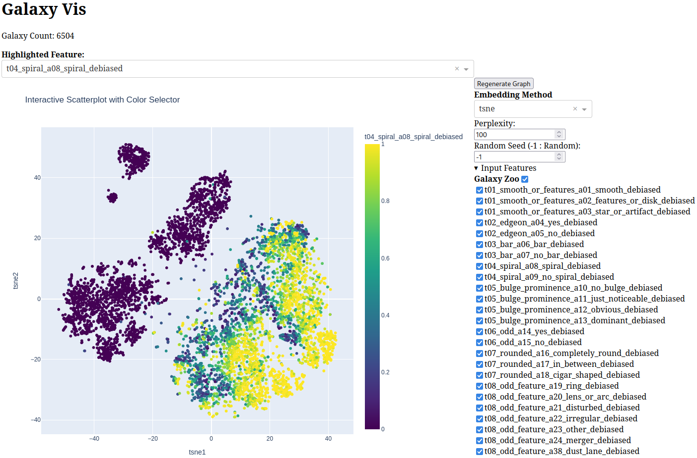
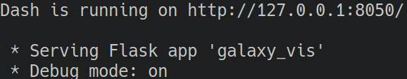

# Galaxy Vis

Interactive data visualization/exploration tool for MaNGA survey
galaxies. 

Inspired by Nathan Rooy's [visual book recommender](https://nathanrooy.github.io/posts/2023-04-12/visual-book-recommender/),
Galaxy Vis is an interactive web browser-based tool
that combines data from SDSS [value added catalogs](https://www.sdss.org/dr18/data_access/value-added-catalogs) (VAC) to
perform embeddings of galaxies for further analysis.

Below is an example t-SNE embedding 
using [Galaxy Zoo](https://www.sdss.org/dr18/data_access/value-added-catalogs/?vac_id=94) morphology feature data
with confidence in spiral-type galaxies highlighted. Hovering
over a data point will reveal the MaNGA ID for the respective
galaxy and clicking the data point will open the galaxy's
page on Marvin for more detailed examination.



In addition to embeddings, a number of clustering
algorithms are available for automatically classifying
data points. Cluster labels can be exported for usage in
external analysis.

Below are the results of running agglomerative clustering
on the above embedding. These charts are automatically produced
in Galaxy Vis and are interactive with configurable parameters
for adjusting the clustering algorithm. T-Type classifications 
are taken from the [MaNGA Visual Morphologies](https://www.sdss.org/dr18/data_access/value-added-catalogs/?vac_id=80) VAC and are not
used in the embedding input feature set.


## Setup

Currently, Galaxy Vis has only been tested on Linux.

`conda` is used for managing Python dependencies. To setup the
environment:

```
conda env create -f galaxy_vis_env.yml
```

The `get_data.sh` script will download the needed VACs to the `./data` directory.

```
./get_data.sh
```

Once the required libraries and data sets are installed, Galaxy Vis
can be run with the `galaxy_vis.py` script.

```
python galaxy_vis.py
```

After some setup, a message will be displayed as shown below.
Navigating to the given local host address with a web browser
will open up Galaxy Vis.

